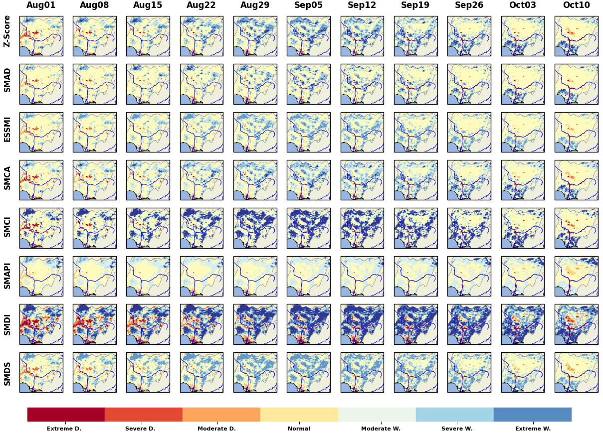

.. These are examples of badges you might want to add to your README:
   please update the URLs accordingly

.. image:: https://readthedocs.org/projects/smadi/badge/?version=latest
   :alt: ReadTheDocs
   :target: https://smadi.readthedocs.io/en/latest/readme.html

.. image:: https://img.shields.io/pypi/v/smadi.svg
   :alt: PyPI-Server
   :target: https://pypi.org/project/smadi/

.. image:: https://mybinder.org/badge_logo.svg
   :alt: Binder
   :target: https://mybinder.org/v2/gh/MuhammedM294/SMADI_Tutorial/main?labpath=Tutorial.ipynb

.. image:: https://img.shields.io/badge/-PyScaffold-005CA0?logo=pyscaffold
   :alt: Project generated with PyScaffold
   :target: https://pyscaffold.org/

=====
SMADI
=====

    Soil Moisture Anomaly Detection Indicators

This repository contributes to a visiting research activity within the framework of `EUMETSAT HSAF <https://hsaf.meteoam.it/>`_, hosted by `TU Wien <https://www.tuwien.at/mg/geo>`_, on the subject "development of workflows for climate normal and anomaly calculation for satellite soil moisture products".

SMADI is a comprehensive workflow designed to compute climate normals and detect anomalies in satellite soil moisture data. The primary focus is on `ASCAT <https://hsaf.meteoam.it/Products/ProductsList?type=soil_moisture>`_ surface soil moisture (SSM) products. By establishing the distribution of SSM for each period and location, SMADI computes climatology, or climate normals, and subsequently identifies anomalies.

The core objective of SMADI is to leverage these anomaly indicators to identify and highlight extreme events such as droughts and floods, providing valuable insights for environmental monitoring and management. Furthermore, the methods used apply to other meteorological variables, such as precipitation, temperature, and more.

Features
========

-         **Data Reading**:  Read and preprocess the input data from Supported data sources. :mod:`smadi.data_reader` 

-        **Climatology**: Compute the climatology for the input data based on different time steps (e.g., monthly, dekadal, weekly, etc.). :mod:`smadi.climatology`

-        **Anomaly Detection**: Detect anomalies based on the computed climatology using different anomaly detection indices. :mod:`smadi.anomaly_detectors`

-        **Visualization**: Visualize the computed climatology and anomalies as time series, maps, and histograms. :mod:`smadi.plot , smadi.map`

Case Studies
============

Romania Drought Event 2007
--------------------------

 

Senegal Drought Event 2014
--------------------------

Germany Flood Event 2021
------------------------

Nigeria Flood Event 2022
------------------------

